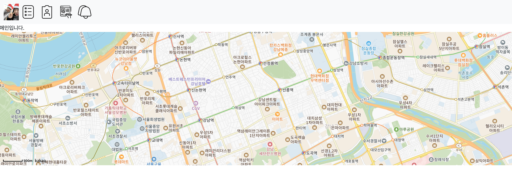
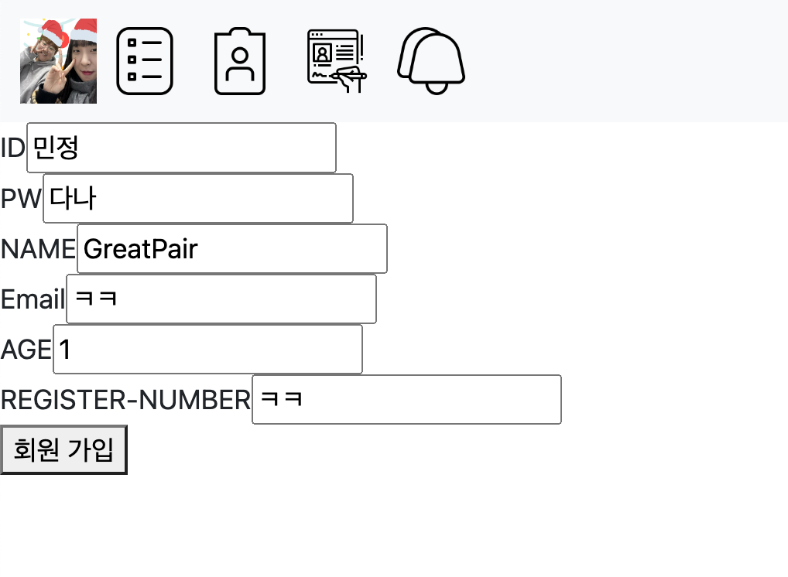
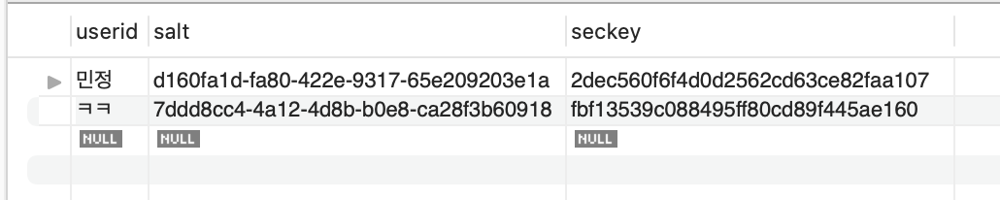
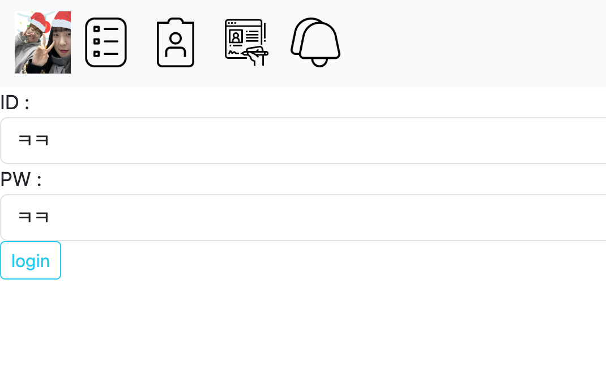
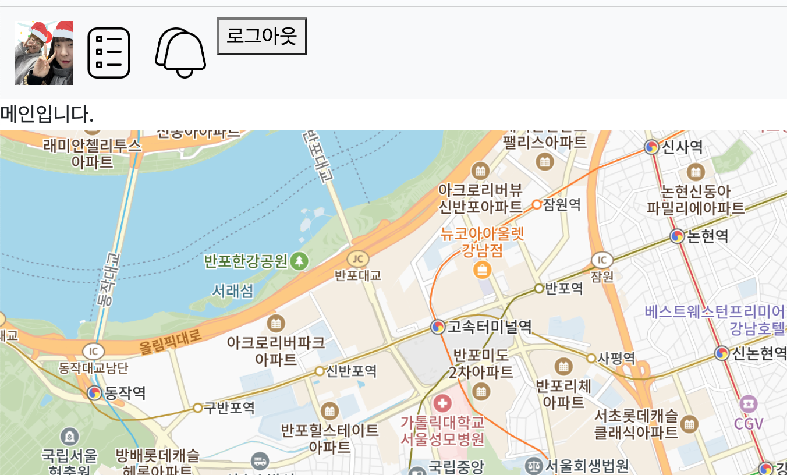
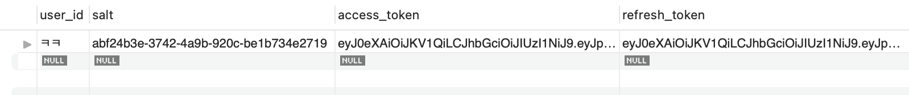

# 10_Vue

## 🎄 팀원 🎄
강민정 김다나
<br>
<br>
## ⛏구현 기능 개요
### 1. 로그인 보안 처리
- 회원가입 시 비밀번호와 주민번호를 암호화 처리하여 저장함.
- 유저의 정보와 암호화 하는데 쓰인 salt 와 키를 다른 DB에 저장하도록 함.
<br>

### 2. 계획 기능
- 사용자가 여행 계획을 입력할 수 있게 함. 또한, 다른 사용자를 언급할 수 있도록 함.
- 사용자가 여행 계획을 조회할 수 있게 함.
<br>


### 3. 언급 기능
- 여행 계획을 입력할 때 다른 사용자를 언급할 수 있게 함.
- 언급된 사용자는 로그인 한 후 알림 탭에서 자신이 언급된 여행 계획을 볼 수 있음.
- 자신이 언급된 여행계획을 조회한 후에는 알림창에서 해당 계획이 사라짐.
<br>

## 🛠구현기능 상세
#### 메인 화면
<br>
### 1. 로그인 보안 처리
<br>
<br>
<br>
회원가입 칸
<br> 
<br>
<br>
저장된 유저의 정보 
<br>
<br>
<br>
저장된 키와 salt 

#### 로그인 화면
<br>
<br>
<br>
<br>
<br>
<br>
<br>
<br>
로그인을 하면, 생성된 jwt access, refresh token과 user_id 를 SessionStroage 에 저장하여
로그아웃 버튼을 보여지게 하고 로그인 상태를 유지하도록 했다.


### 2. 계획 기능

#### 여행 계획 등록

<br>
사용자가 입력한 여행 계획

```javascript
// plan.js
function writePlan(param, success, fail) {
    param.access_token = sessionStorage.getItem("access_token")
    local.post(`/plan/regist`, param).then(success).catch(fail);
}

// planWriteView.vue
function registPlan() {
    const body = {
        userid: userid.value, 
        title: title.value,
        content: content.value, 
        mentionedid: mentionedid.value.split(",")
    }
    writePlan(body,
        ({ data }) => {
          console.log(data)
        },
        (err) => {
          console.log(err)
    })
}
```
위 함수들을 이용하여 객체 형태로 Back에 사용자의 정보를 전달함.


<br>
여행 계획 DB에 저장된 사용자의 정보와 사용자의 글


<br>
멘션 DB에 저장된 언급된 사용자와 언급된 글의 정보

#### 여행 계획 목록


<br>
DB에 저장된 모든 여행 계획을 확인함.

```vue
<tr class="text-conter" v-for="plan in plans" :key="plan.contentid">
    <td>
        <router-link :to="{name:'plan-view', params:{contentid:plan.contentid}}">
            {{ plan.title }}
        </router-link>
    </td>
    <td>{{ plan.userid }}</td>
    <td>{{ plan.timestamp }}</td>
</tr>
```
table의 형태로 v-for을 사용하여 주어진 계획들을 랜더링함.

#### 여행 계획 상세 조회


<br>
조회를 원하는 계획의 제목을 누르면 해당 계획의 상세한 정보를 볼 수 있음.

```javascript
// plan.js
function detailPlan(contentid, success, fail) {
    local.get(`/plan/view/${contentid}`).then(success).catch(fail);
}

// planView.vue
function getPlan(contentid) {
    detailPlan(
        contentid,
        ({data}) => {
            console.log(data);
            plan.value = data;
        },
        (err) => {
            console.log(err);
        }
    )
}

onMounted(() => {
    console.log(route.params.contentid);
    getPlan(route.params.contentid);
})
```
onMounted를 사용하여 component가 붙혀졌을 때 위의 함수를 실행함. PK인 contentid를 사용하여 해당 계획을 조회함


### 3. 언급 기능

#### 알림 확인


<br>
알림의 제목을 누르면 해당 계획의 상세 정보를 조회할 수 있음.
<br>
이 때, aa 사용자로 로그인 한 상태이기 때문에 aa 사용자가 언급된 계획만 볼 수 있음.

<br>

<br>
알림을 확인하고 다시 알림창으로 돌아오면 해당 알림은 사라짐.
<br>

<br>
알림 확인 후 DB에서 isChecked가 true로 바뀐 것을 확인 할 수 있음.

```vue
<tbody>
    <tr class="text-conter" v-for="mention in mentions.filter((m)=> !m.checked)" :key="mention.contentid">
        <td>
            <router-link :to="{name:'plan-view', params:{contentid:mention.contentid}}"  @click.native="clickMention(mention)">
                {{ mention.title }}
            </router-link>
        </td>
        <td>{{ mention.userid }}</td>
    </tr>
</tbody>
```
v-for문에서 filter를 사용하여 checked가 false인, 즉 확인하지 않은 알림만 table에 넣어줌.


## 프로젝트 소감

<b>강민정</b>

```text
이번 프로젝트에서는 BackEnd에서 map의 형태로 반환해준 결과를 FrontEnd에서 vue를 통해 가공하여 사용자에게 정보를 제공하는 화면을 구현하였습니다. 
이 과정에서 BackEnd와 FrontEnd가 어떤 식으로 연결 되는지 알 수 있었습니다. 그리고 BackEnd와 FrontEnd를 따로 개발하며 효율적인 분업이 가능하다는 것을 알게 되었습니다.
또한, BackEnd와 FrontEnd가 개발 과정에서 다른 포트를 사용하여 Http 세션을 사용할 수 없기때문에 대체제로 jwt를 사용하였습니다. 
이를 통해 jwt의 원리에 대해 알 수 있었으며 jwt를 사용할 때에는 보안을 염두에 두어야 한다는 것을 깨달았습니다. 더하여, Http 세션의 효율성에 대해서도 생각해보게 되는 계기가 되었습니다. 
그리고 페어와 함께 힘을 합쳐 기능을 구현해나가는 과정에서 협업의 중요성을 다시 한 번 느끼게 되었습니다.
```

<b>김다나</b>
```text
  Vue.js 라는 javaScript Framework 에 대해 학습하고, 지금까지 jsp 로 구현해왔던 웹페이지들을 Vue 를 이용하여 구현해보았다.
 한 페이지 안에서 여러가지 컴포넌트, item 들을 나눠서 구현하고 반응형 데이터들을 바인딩하며 템플릿에 적용시켰다. 그리고 Vite 라는 빌드 툴을 사용하여
 환경 설정과 개발 환경을 실행하여 구현했고, DOM Tree 구조에 대해 더 자세히 이해할 수 있는 시간이었다.
  Back-End 부분에서는 HttpSession 이 아닌 개발 환경 편의성을 위해 JWT (Java Web Token) 을 이용해보았다. 
HttpSession 을 사용할 수 없는 환경이기때문에 JWT 를 사용하게 되었는데, JWT 의 구성요소와 유의할 점에 대해 알아볼 수 있는 시간이었다.
JWT 는 db access 가 자주 일어나고 정보가 모두 들어있기 때문에 할 수 있다면 HttpSession를 사용하는 것이 좋을 것 같다는 생각이 들었다.
 이번 프로젝트를 통해 풀스택 개발자로서 Front-End 와 Back-End 두 분야를 탐구하며 개발 역량을 함양하고, 개발자로서의 가치관을 좀 더 정립할 수 
있는 기회를 가졌다. 

```
